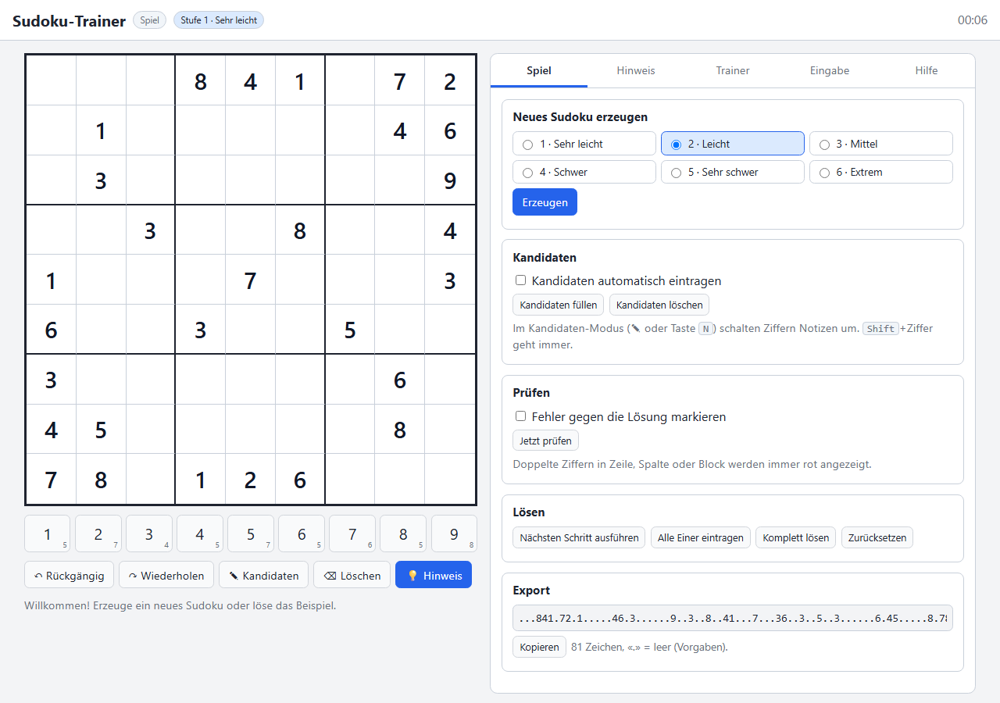
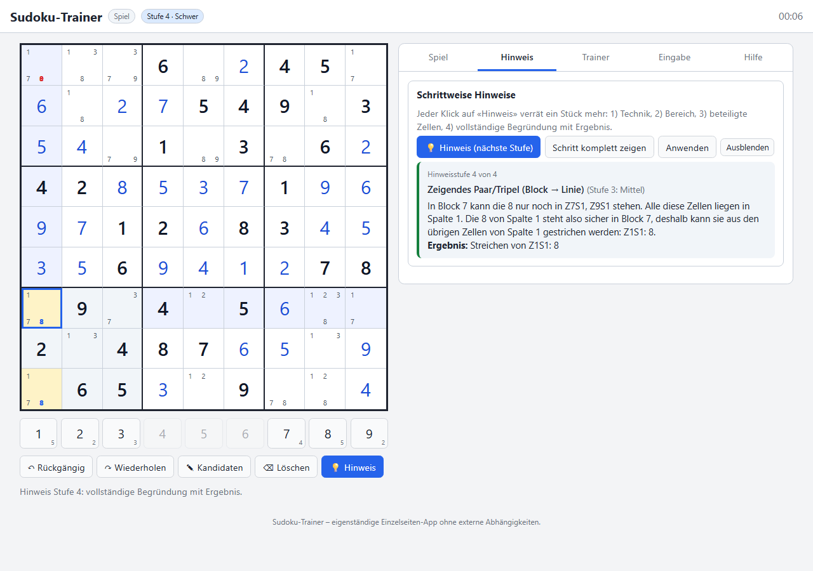
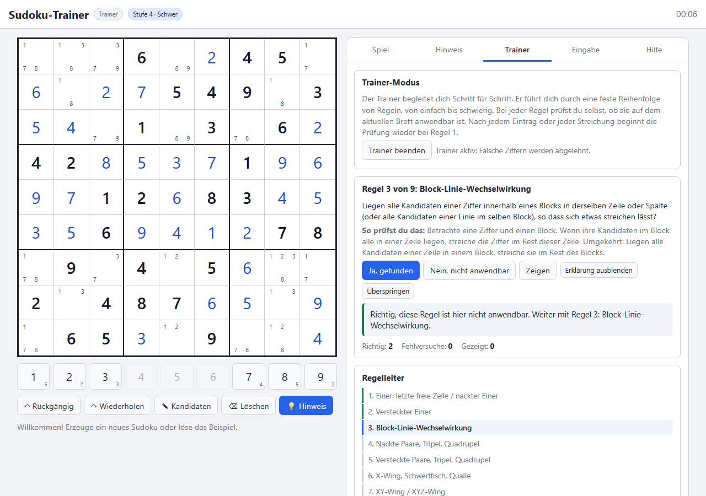
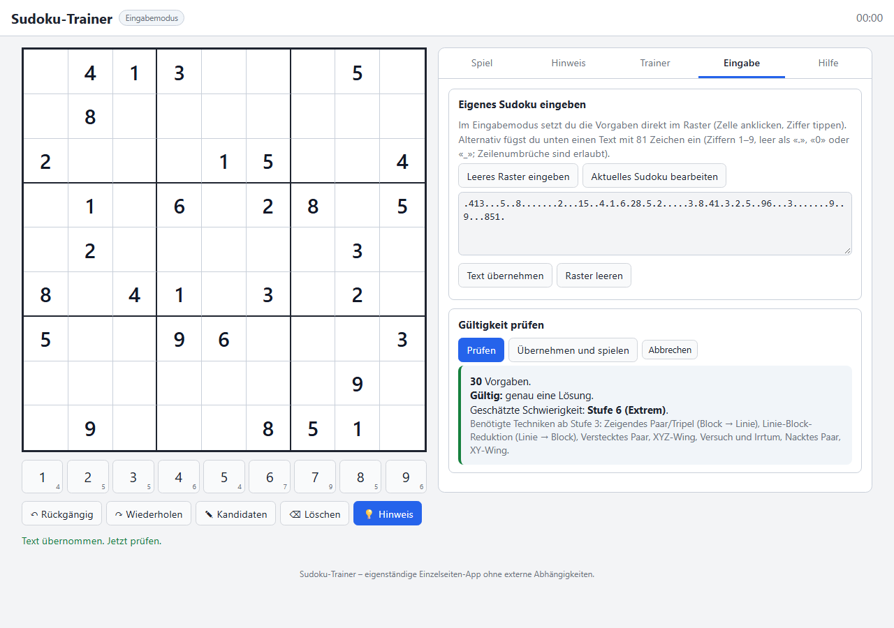

# Teach Me, Don't Tell Me: A Sudoku Trainer in One HTML File

Last summer I let [Google's CP-SAT solver crack Sudokus](https://phabe.ch/2025/08/13/solving-sudoku-with-constraint-programming/) in fractions of a second. Deeply satisfying. Educational? Not really. The solver learned nothing, and neither did I. It just knew.

That is also my problem with every Sudoku app I have tried. You get stuck, you tap "hint", and the app says: *"Row 4, column 7 is a 3."* Thanks. That is not a hint, that is a spoiler with extra steps. What I wanted was a coach. Someone who leans over my shoulder and says: *"You keep scanning for singles. Have you looked at what the 8 is doing in block 7?"* And only if I am still lost, a bit more. And only at the very end, the full explanation.

So the requirements wrote themselves:

- A solver that thinks in **human strategies**, not in backtracking, and hands out hints in escalating doses.
- A **trainer mode** that makes me check the rules in the right order until it becomes a habit.
- A **generator** for puzzles of six difficulty levels, plus a **validator** for puzzles I type in from the newspaper.
- And, as always on this blog: **one HTML file, zero dependencies, no build step**. Double-click, play.

I built it in my spare time together with Claude Code (Fable 5.1). I brought the requirements, the stubbornness about the one-file rule and a lot of "no, the hint is still too explicit". Claude brought eighteen solving techniques, a test suite that caught its own bugs, and the patience to explain a Swordfish in German. More on that below.

## Some Sudoku Facts to Ruin Your Next Dinner Party

- The puzzle is **not Japanese**. It was invented by Howard Garns, a retired architect from Indiana, and appeared as "Number Place" in a Dell puzzle magazine in 1979. The Japanese publisher Nikoli picked it up in 1984 and named it *Sūji wa dokushin ni kagiru*, "the digits must remain single". Mercifully shortened to Sudoku.
- The ancestor is older still: Leonhard Euler wrote about **Latin squares** in 1782. A Sudoku is a Latin square with the extra 3×3-box rule bolted on.
- There are **6,670,903,752,021,072,936,960** valid filled grids (Felgenhauer and Jarvis, 2005). If you count grids that are the same up to rotation, reflection and relabelling only once, 5,472,730,538 remain. Still enough for a few lifetimes of Sunday mornings.
- A puzzle needs **at least 17 clues** to have a unique solution. Nobody has ever found a valid 16-clue puzzle, and in 2012 McGuire, Tugemann and Civario proved there is none, with an exhaustive search that burned millions of CPU hours. About 49,000 different 17-clue puzzles are known.
- Sudoku on a general n²×n² board is **NP-complete** (Yato and Seta, 2003). On the 9×9 board that is a purely theoretical threat; my phone solves any of them before the screen finishes fading in.
- In 2012 the Finnish mathematician Arto Inkala published what he called the "world's hardest Sudoku". I typed it into the validator. Verdict: *Level 6, extreme, trial and error required, five times.* Good to know the app and the newspapers agree on something.

## The App in Ninety Seconds

Everything lives in one file, [index.html](https://github.com/phabee/sudoku-trainer), 95 KB, no framework, no CDN, no server. Your progress is saved in the browser's local storage and nowhere else.

**Hints come in four doses.** The first click only names the technique ("this is a job for a *hidden single*"). The second points at a region ("look at the 8 in block 7"). The third highlights the cells involved. Only the fourth click spells out the full argument and offers an "apply" button. If there is a mistake on the board, the hint engine refuses to help until you find it, again in four doses, from "something is wrong" down to the exact cell.

**The trainer mode is the part I actually wanted.** It walks you through a fixed ladder of nine rule groups, from "any cell with a single candidate?" up to "time to try and fail". At each rung you answer: yes, this rule applies here, or no, it does not. Say "no" when it does apply, and the trainer gently disagrees and gives you a nudge. Say "yes" and you have to click the cell and enter the digit yourself. Wrong digits are rejected with a reason. And after every single change on the board, the ladder resets to rung one, because that is exactly the discipline I keep failing at: after every placement, look for the cheap stuff first.

**The generator** produces puzzles in six levels, from "only naked singles" to "no known technique suffices". **The validator** takes 81 characters, tells you whether the puzzle has zero, one or several solutions, and rates its difficulty. All in the browser, in well under a second.

## For the Curious: Why Generating Sudokus Is Harder Than Solving Them

### Backtracking, the boring hero

The fast solver is textbook backtracking with two tricks that make it fast enough to run thousands of times per second in JavaScript. First, **bitmasks**: for each row, column and box a 9-bit integer remembers which digits are taken, so the candidates of a cell are one `OR` and one `NOT` away. Second, **most constrained cell first**: always fill the cell with the fewest candidates. If a cell has exactly one candidate, there is nothing to guess; if it has zero, back up immediately. A full random grid takes about a millisecond. Counting solutions works the same way, except you stop at two, because "unique" is the only question that matters.

### The human solver is the real product

The backtracker knows *that* a cell is a 3. It has no idea *why*. For hints, you need a second solver that plays like a person: naked and hidden singles, pointing pairs, naked and hidden subsets, X-Wing, Swordfish, Jellyfish, XY- and XYZ-Wing, simple colouring, and, as the last resort, bifurcation. Eighteen techniques, sorted from cheap to expensive. Every technique returns a *step*: the cells involved, the eliminations or placement, and a German explanation with the reasoning. The four hint levels are just four views of the same step object. The trainer asks the same solver "show me *all* instances of rule group 3" to check whether your click hit a real one.

Correctness matters here more than anywhere. A hint that eliminates the right digit is not a hint, it is sabotage. So the test suite solves random puzzles step by step and checks every placement and every elimination against the known solution. Over 22,000 steps, zero errors. The suite also caught a genuinely embarrassing bug on the first run: `Array.from({length: 81}, i => …)` hands you the *value* (undefined), not the index, so every cell had `NaN` peers. Sudoku without peers is very easy and very wrong.

### Difficulty is whatever the human solver had to do

How hard is a puzzle? The honest answer is: as hard as the hardest technique the human solver needed on the way to the solution. Because the techniques are tried cheapest first, this is reproducible, and it gives a natural six-level scale.

### The generator's dirty secret

Generating a puzzle is easy: take a full grid, remove clues while the solution stays unique, stop when nothing more can go. Generating a puzzle **of a given difficulty** is where it gets interesting. I measured what random minimal puzzles actually look like:

| Hardest technique needed | Share of random puzzles |
|---|---|
| Hidden single | 60 % |
| Trial and error | 15 % |
| Only singles | 8 % |
| Box-line interactions | 7 % |
| XY-/XYZ-Wing, colouring | 8 % |
| Naked or hidden pair | 1.5 % |
| X-Wing or triple | 0.1 % |

Random Sudokus are mostly boring, occasionally brutal, and almost never "pleasantly hard". My first level 4 was defined as "triples or X-Wing" and the generator found exactly zero of them in 150 attempts. So two things changed. XY-Wing and XYZ-Wing moved down to level 4, which is where most Sudoku literature puts them anyway. And the carving got a **difficulty ceiling**: a clue may only be removed if the puzzle stays unique *and* the rating does not exceed the target level. That pushes every puzzle to be as hard as possible without overshooting, and it lifts the hit rate for level 4 from zero to a workable seven percent. At two to three milliseconds per attempt, that is a sub-second wait, with a spinner for the unlucky cases.

One more hurdle I did not see coming: hints must reason about the candidates **you see**, not about the candidates the machine computes from scratch. Otherwise, after you apply a naked pair, the engine recomputes everything, rediscovers the same naked pair and proposes it again. Forever. The fix is a one-liner conceptually and a surprising amount of state management in practice.

## Try It

The whole thing, including the human solver, the trainer ladder, a Node test suite and a benchmark script, is on GitHub: [github.com/phabee/sudoku-trainer](https://github.com/phabee/sudoku-trainer). MIT licensed. Download `index.html`, open it, and let the trainer nag you about checking for singles first. It is right, you know.
